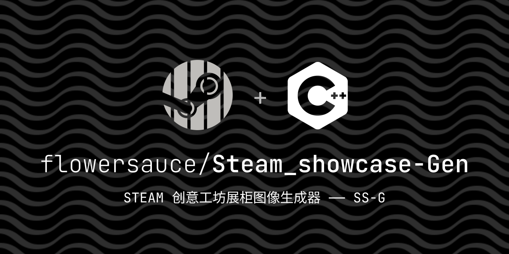
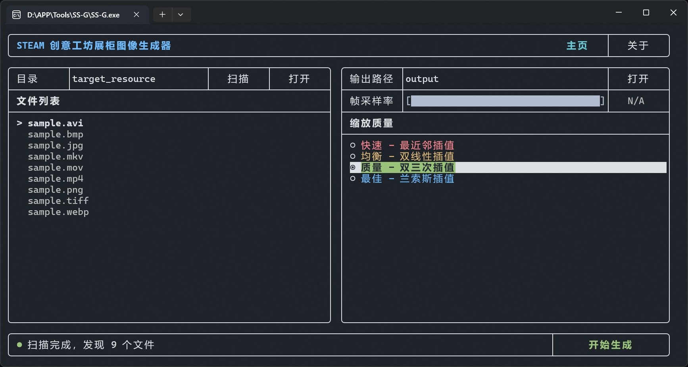

> **这是一个基于 FTXUI 的 TUI 练习项目，旨在为 Steam 创意工坊展柜打造的一站式切片生成工具。**
> 支持将视频或图片自动裁剪、切片并转换为 GIF，内置 Hex Hack 以防止 Steam 压缩黑边。

---

## 🖼️ 预览



---

## ✨ 功能特性

* **多格式支持**：支持视频 (`.mp4`, `.avi`, `.mov`, `.mkv`) 和图片 (`.png`, `.jpg`, `.jepg`, `.bmp`, `.webp`, `.tif`,
  `.tiff`)
  输入。
* **自动切片**：自动调整比例并切割为 Steam 展柜标准的 5 张切片 (150px 宽 + 4px 间隙)。
* **Hex Hack 集成**：自动修改 GIF 文件尾部字节 (`0x3B` -> `0x21`)，利用 Steam 特性实现“无限高度”及防止压缩。
* **TUI 交互界面**：基于 FTXUI 的现代化终端用户界面，操作直观。
* **高度可配**：
    * 支持调节 **帧采样率** (Frame Skip) 以控制文件体积。
    * 提供 4 档 **缩放算法** (Nearest, Bilinear, Bicubic, Lanczos)。

## 🛠️ 技术栈 (Tech Stack)

本项目使用 **C++23** 开发，核心依赖以下开源库：

| 库 / 工具                                               | 用途                |
|:-----------------------------------------------------|:------------------|
| **[OpenCV](https://opencv.org/)**                    | 图像读取、视频流处理、图像缩放   |
| **[FFmpeg](https://ffmpeg.org/)**                    | 高级 GIF 编码、色彩空间转换  |
| **[FTXUI](https://github.com/ArthurSonzogni/FTXUI)** | 渲染跨平台终端用户界面 (TUI) |
| **[CMake](https://cmake.org/)**                      | 项目构建系统            |

## 🔧 核心逻辑

本项目采用 **“时空解构 (Spatiotemporal Deconstruction)”** 方案，摒弃了传统的视频裁剪思路，将复杂的视频流处理降维为纯粹的图像矩阵运算，实现了对每一帧的像素级精确控制。

```text
[ Video Stream ]
        │
        ▼
[Temporal Demux]
        ├─ Frame 1 ──┐
        ├─ Frame 2 ──┼──▶ [Buffer] -> [Image Processor]     # 1. 降维: 视频 -> 静态帧序列
        └─ ...    ───┘
              │
              ▼
   ┌ [ Global Resize (766px) ] ────────┐                    # 2. 整形: 统一缩放至 Steam 创意工坊展柜标准宽度
   │                                   │
   ▼                                   ▼
┌─────┐  ┌─────┐  ┌─────┐  ┌─────┐  ┌─────┐
│Slice│  │Slice│  │Slice│  │Slice│  │Slice│                 # 3. 切分: 5x1 矩阵掩码提取 (自动扣除 4px 间隙)
│  1  │  │  2  │  │  3  │  │  4  │  │  5  │
└──┬──┘  └──┬──┘  └──┬──┘  └──┬──┘  └──┬──┘
   │        │        │        │        │
   ▼        ▼        ▼        ▼        ▼
[GIF 1]  [GIF 2]  [GIF 3]  [GIF 4]  [GIF 5]                 # 4. 重组: 并行编码流回写
```

## 🚀 快速开始

### 前置要求

* C++23 编译器
    * Windows : 建议 MSVC v14.50+
    * Linux / MacOS : 架构已支持，代码尚未实现
* CMake 3.25+
* [vcpkg](https://github.com/microsoft/vcpkg) (用于管理依赖)

### 构建步骤

```bash
# 1. 克隆仓库
git clone https://github.com/flowersauce/Steam_showcase-Gen.git
cd Steam_showcase-Gen

# 2. 配置项目 (假设使用 vcpkg)
cmake -B build -S . -DCMAKE_TOOLCHAIN_FILE=[您的vcpkg路径]/scripts/buildsystems/vcpkg.cmake

# 3. 编译
cmake --build build --config Release
```

## 📖 使用指南

1. **启动程序**：运行 `SS-G.exe`，在主页输入或扫描 **源文件目录**。
2. **选择资源**：在左侧文件列表中选择要转换的图片或视频文件。
3. **参数设置**：

    * **输出路径**：设置生成文件的保存位置。
    * **帧采样率**：调整 GIF 的帧数密度（采样率越低，文件越小）。
    * **缩放质量**：根据需要选择画质算法（推荐使用 "平衡" 或 "高质量"）。

4. **开始生成**：点击 `[开始生成]` 按钮，程序将自动处理并输出切片。
5. **自动优化**：生成的切片 (`slice_1.gif` ~ `slice_5.gif`) 将自动应用 Hex Hack。
6. **上传辅助**：在软件的 **“关于”** 页面，您可以查看并一键复制上传至 Steam 创意工坊所需的控制台代码。

## 📄 许可证

本项目基于 [MIT License](LICENSE) 开源。

---

**Copyright (c) 2026 Flowersauce**
